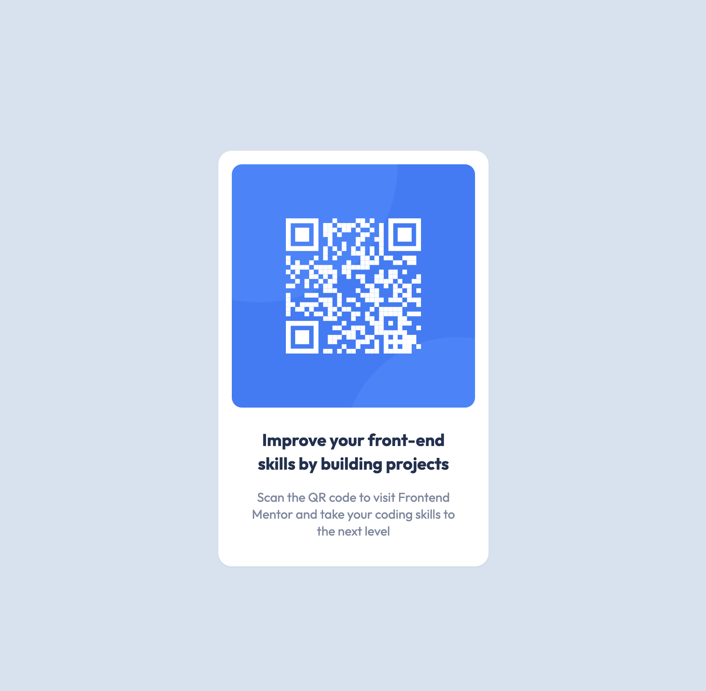

# Frontend Mentor - QR code component solution

This is a solution to the [QR code component challenge on Frontend Mentor](https://www.frontendmentor.io/challenges/qr-code-component-iux_sIO_H). Frontend Mentor challenges help you improve your coding skills by building realistic projects.

## Table of contents

- [Overview](#overview)
  - [Screenshot](#screenshot)
  - [Links](#links)
- [My process](#my-process)
  - [Built with](#built-with)
  - [Useful resources](#useful-resources)
- [Author](#author)

## Overview

This is my first project on frontendmentor..

### Screenshot

### Links

- Solution URL: [Add solution URL here](https://your-solution-url.com)
- Live Site URL: [Add live site URL here](https://your-live-site-url.com)

## My process

### Built with

- CSS Grid
- Mobile-first workflow
- [React](https://reactjs.org/) - JS library
- [Tailwindcss](https://tailwindcss.com/) - For styles
- [Vite](https://vitejs.dev/) - Build tool

### Useful resources

- [peko-step](https://www.peko-step.com/) - convert color from HSL to HEX

## Author

- Frontend Mentor - [@yourusername](https://www.frontendmentor.io/profile/rkritchat)
